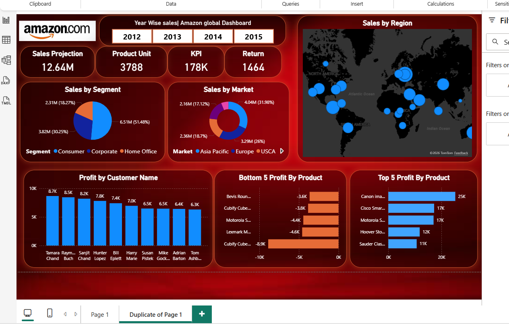

# Amazon Global Sales Dashboard (Power BI)

🔹 Overview

This project presents an interactive Power BI dashboard built to explore and analyze Amazon’s global sales data.
The goal was to transform raw sales data into a clear and visually structured report that highlights performance trends, regional distribution, and profitability insights.

The dashboard focuses on making business data easy to understand through clean visuals and meaningful KPIs.

🔹 What this dashboard shows

* Year-wise sales performance
* Regional and market-level comparison
* Product profitability insights
* Top and bottom performing products
* Customer-level profit contribution
* Key metrics such as total sales, units sold, and returns

🔹Tools Used

* Power BI Desktop
* Microsoft Excel
* Data cleaning and transformation
* Data visualization techniques

## Dashboard Preview



🔹 Approach

The dataset was cleaned and structured in Excel before being imported into Power BI.
Different visual elements such as KPI cards, maps, bar charts, and filters were used to make the dashboard interactive and easy to explore.
A consistent theme and layout were applied to maintain clarity and readability.

🔹 Files Included

```
amazon-sales-powerbi-dashboard
 ┣ Assets
 ┃ ┣ Amazon_logo.png
 ┃ ┣ theme.json
 ┣ global_superstore.xlsx
 ┣ pbi_dashboard.png
 ┣ Project1powerBi.pbix
 ┣ README.md
```

🔹 About this project

This dashboard was created as part of my data analytics learning journey and portfolio development.
It reflects my understanding of data visualization, dashboard design, and extracting insights from structured datasets using Power BI.

👨‍💻 Author

Karan Kumar Chauhan
B.Tech — Computer Science Engineering (Data Science)

